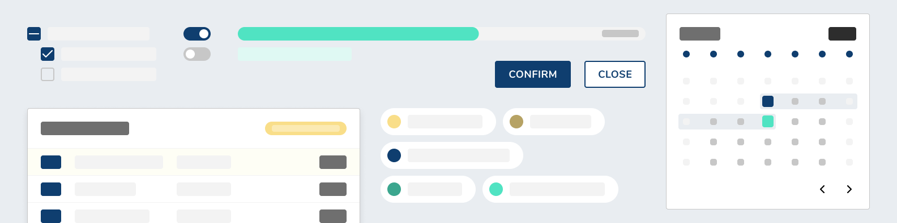

# Avail Design Kit

A set of components built to be `composable`, `extendable`, and `usable`

## [Documentation](https://avail-design.now.sh)

## Contributing

The best way to contribute to this library is to look at open issues or file an issue yourself if one doesn't already exist.

To suggest a component be added to the library open an issue and spec out the component with it's API. No component will be added without proper documentation. You can tag @pkrawc or @wade00 with reviewing the issue and weighing in when necessary.

To finish, create a pull request that solves the issue. At least one commit in the PR should be `resolves #[ISSUE_NUMER]`, this will auto-close the issue when the PR is merged into master.