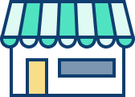

# Avail Design Kit

Resources, tooling, and component architecture patterns for designing UI at Avail.

## Product Personality

We use design at Avail to create consistent, delightful, and intuitive experiences across touch points and sessions. We solve challenging interactions every day and our design language should be flexible enough to grow with our solutions.

### Confidence

We take a stand. Not everyone will agree with what we say — and that's okay. We state our position and back it up with reasoning and data. Our confidence shows in our bold color choices and direct user journeys.

### Curiosity

Our designs are built to evolve because we're always learning. We employ a scientific methodology to improving Avail products, hypothesizing, testing, and revising the system to best fit our audience.

### Convenience

Avail is built to make the process of renting easier for all landlords and tenants, because of that we strive to be as inclusive as possible. We embrace humanist design with simple shapes and ample spacing.
