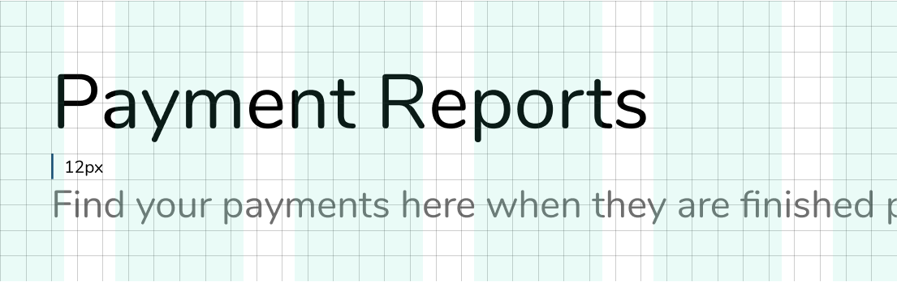
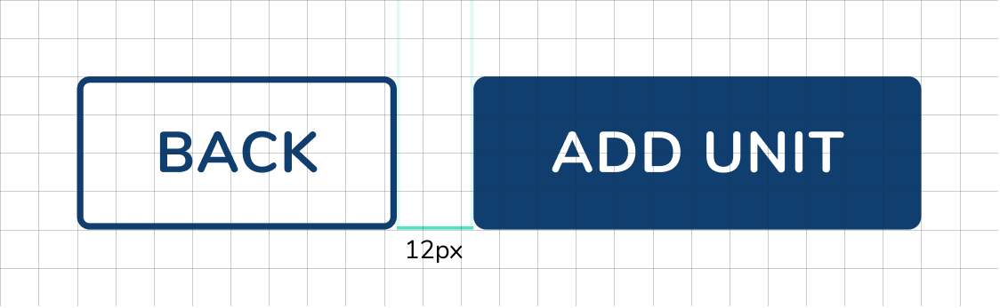

# Baseline Grid

Consistent use of a grid system provides a visual rhythm that a facilitates understanding and brings order to our layouts.

We work from a 12px grid

This baseline convention naturally flows on to the rest of the grid system, which includes icons, components, and layout dimensions. Always try to align objects on the 12px grid, but where necessary, use good judgement to fine tune your designs to 6px. The 6 pixel baseline is there to allow more flexibility for line heights and smaller adjustments.

