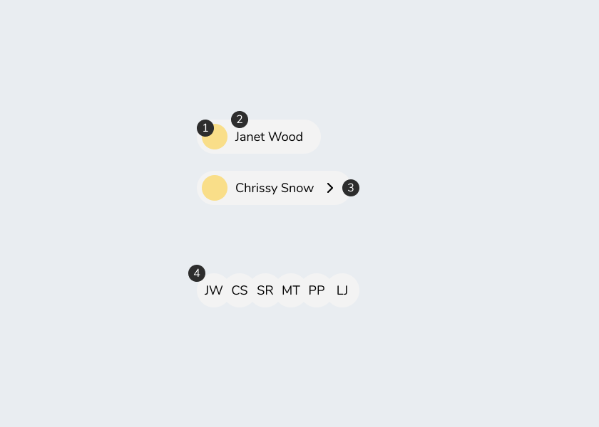

import { Props } from "docz"
import Playground from "utils/playground"
import { ExternalLink } from "react-feather"
import Avatar, { AvatarGroup } from "../avatar"

# Avatars

```
import Avatar, { AvatarGroup } from "@rent_avail/elements/avatar"
```

## Description

An avatar component is used to display user information to another user. It can be used in a variety of sizes and spaces and is often clickable and opens more in-depth information about the user such as account or payment status.

## Anatomy



1. User Photo
2. User Name
3. Icon
4. Avatar Group

## Usage

### Avatar

<Playground>
  <Avatar small initials="JW" />
  <Avatar name="Janet Wood" photoUrl="https://source.unsplash.com/collection/802865/48x48" />
  <Avatar
    name="Janet Wood"
    photoUrl="https://source.unsplash.com/collection/802865/48x48"
    icon={ExternalLink}
  />
</Playground>

### Avatar Group

Stacked avatars represent a group of people

<Playground>
  <AvatarGroup>
    <Avatar small initials="PK" />
    <Avatar small initials="PS" />
    <Avatar small initials="ND" />
    <Avatar small initials="RB" />
  </AvatarGroup>
</Playground>

## Extension

The avatar component passes all props to its underlying dom node.

```js
const CustomAvatar = styled(Avatar)`
  background: red;
  color: green;
`
```
